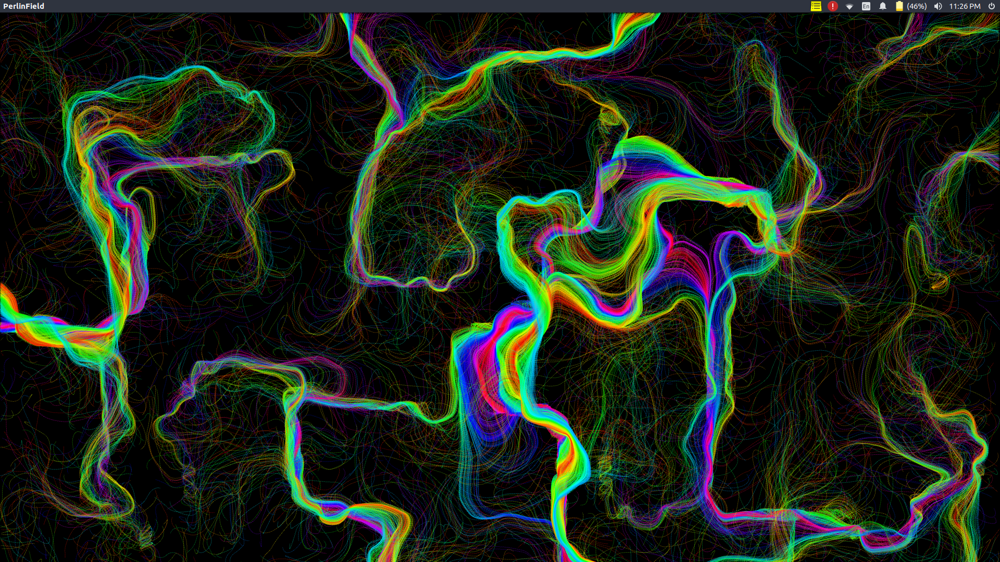
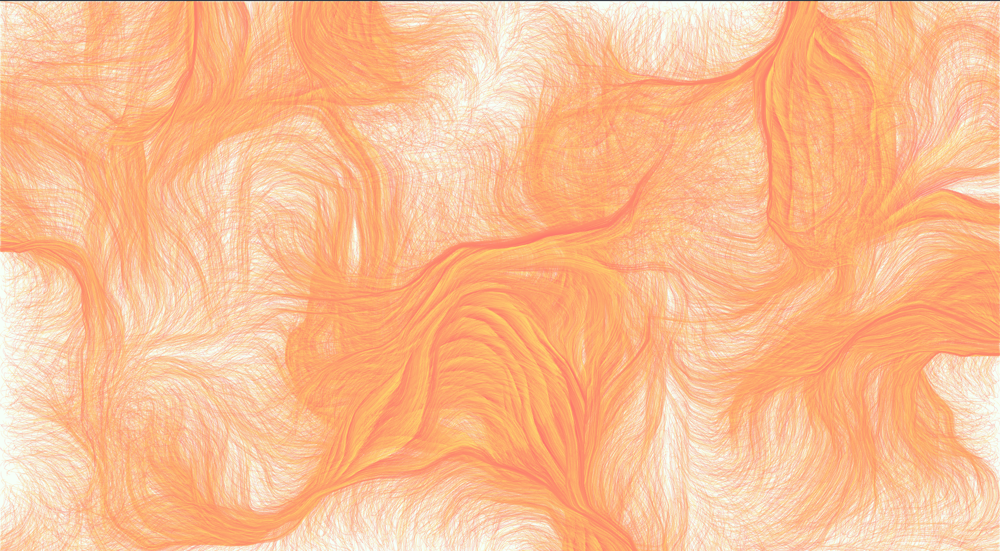

# Perlin Noise Field
Perlin noise is a type of gradient noise developed by Ken Perlin in 1983 as a result of his frustration with the "machine-like" look of computer graphics at the time.

An array of points are created, which scatters around and canvas and follows the noise field lines. This allows for some interesting patterns and artworks.

## Requirements
  Processing
  
## Samples
Below are two samples using different colour modes

