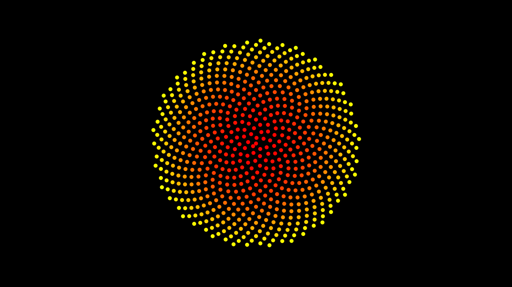

# Phyllotaxis

In botany, phyllotaxis or phyllotaxy is the arrangement of leaves on a plant stem. Phyllotactic spirals form a distinctive class of patterns in nature. A repeating spiral can be represented by a fraction describing the angle of windings leaf per leaf. These types of patterns are seen plenty in nature for instance sunflowers.

The angle used in this example is 137.5 degrees. This is known as the Fibonacci Angle.

## Samples

